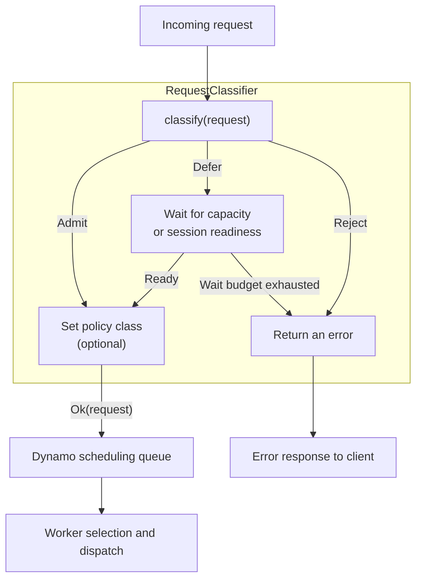

> [!WARNING]
> **Experimental.** The request-classifier API and its inputs can change.

Implement `RequestClassifier` to control when NVIDIA Dynamo admits a request to the KV router's scheduling queue. Use it to wait for capacity, assign a policy class, or reject a request that has exceeded its wait budget.

The built-in [ThunderAgent plugin](../../../../use-cases/agents/thunderagent-program-scheduler.md#native-frontend-plugin) uses this API to hold requests from paused or busy sessions. Select it through router-policy YAML if it fits your workload. Write a custom classifier when you need a different admission rule.

## How It Works

Dynamo calls `classify` before queueing a request. Return `Ok(request)` to admit it, wait asynchronously to defer it, or return an error to reject it. Before admitting the request, the classifier can set its policy class, queue deadline, scheduling cost, or preferred worker.



A classifier can work with either built-in or [custom worker selection](custom-worker-selection.mdx). Dynamo enforces worker eligibility, hard pins, and reservations.

This guide uses the embedded KV router in `dynamo.frontend`. Classification runs on aggregated or decode routing; in disaggregated serving, remote prefill can start before this admission decision. Standalone selection, including standalone EPP, does not support a configured classifier.

## Build the Classifier

This example limits router queue waiting to a configured budget measured from request ingress. It rejects requests whose budget has already expired and admits the rest with that deadline.

### Create the Classifier and Catalog Crates

Set the checkout and plugin project paths, then create a classifier crate and a catalog crate for registration:

```bash
export DYNAMO_DIR=/work/dynamo
export PLUGIN_DIR=/work/acme-admission
mkdir -p "$PLUGIN_DIR"
cargo init --lib --name acme-admission "$PLUGIN_DIR/classifier"
cargo init --lib --name acme-admission-catalog "$PLUGIN_DIR/catalog"
```

Add the classifier's API, error, configuration, and time dependencies:

```bash
cargo add --manifest-path "$PLUGIN_DIR/classifier/Cargo.toml" --path "$DYNAMO_DIR/lib/kv-router" dynamo-kv-router
cargo add --manifest-path "$PLUGIN_DIR/classifier/Cargo.toml" --path "$DYNAMO_DIR/lib/runtime" dynamo-runtime
cargo add --manifest-path "$PLUGIN_DIR/classifier/Cargo.toml" serde --features derive
cargo add --manifest-path "$PLUGIN_DIR/classifier/Cargo.toml" tokio --features time
```

Add the classifier and registry API to the catalog:

```bash
cargo add --manifest-path "$PLUGIN_DIR/catalog/Cargo.toml" --path "$PLUGIN_DIR/classifier" acme-admission
cargo add --manifest-path "$PLUGIN_DIR/catalog/Cargo.toml" --path "$DYNAMO_DIR/lib/kv-router" dynamo-kv-router
```

### Classify Requests

Put the classifier in `classifier/src/lib.rs`. `set_due_at` tells Dynamo when to stop queueing the request:

```rust
use std::time::Duration;

use dynamo_kv_router::plugins::request_classifier::{
    ClassifierError, ClassifyFuture, ClassifyRequest, RequestClassifier,
};
use dynamo_runtime::error::{DynamoError, ErrorClass};
use tokio::time::Instant;

struct QueueBudget {
    budget: Duration,
}

impl RequestClassifier for QueueBudget {
    fn classify(&mut self, mut request: ClassifyRequest) -> ClassifyFuture {
        let deadline = request.ingress_at() + self.budget;
        Box::pin(async move {
            if Instant::now() >= deadline {
                return Err(Box::new(
                    DynamoError::builder()
                        .class(ErrorClass::CapacityExhausted)
                        .diagnostic("admission wait budget exhausted")
                        .public_message("Admission wait budget exhausted; retry later")
                        .build(),
                ) as Box<ClassifierError>);
            }
            request.set_due_at(deadline);
            Ok(request)
        })
    }
}
```

For intentional rejection, return a typed `DynamoError`. `ErrorClass::CapacityExhausted` produces HTTP 529 by default; set `DYN_HTTP_OVERLOAD_STATUS_CODE=429` to return 429. Use `ErrorClass::RateLimited` for caller-specific limits, which return 429.

### Parse Parameters and Create the Factory

Add the provider below the classifier in `classifier/src/lib.rs`. Dynamo calls it at startup to validate the YAML parameters, then uses the returned factory to create a classifier for each model's router:

```rust
use std::sync::Arc;

use dynamo_kv_router::plugins::request_classifier::{
    RequestClassifierFactory, RequestClassifierParameters, RequestClassifierProviderError,
};

#[derive(serde::Deserialize)]
#[serde(deny_unknown_fields)]
struct Parameters {
    max_wait_ms: u64,
}

fn provider(
    parameters: &RequestClassifierParameters,
) -> Result<RequestClassifierFactory, RequestClassifierProviderError> {
    let parameters: Parameters = parameters.deserialize()?;
    if !(1..=60_000).contains(&parameters.max_wait_ms) {
        return Err(RequestClassifierProviderError::new(
            "max_wait_ms must be between 1 and 60000",
        ));
    }
    let budget = Duration::from_millis(parameters.max_wait_ms);
    Ok(Arc::new(move |_context| Box::new(QueueBudget { budget })))
}
```

Each factory-created classifier owns its state. Separate frontend replicas have separate admission budgets unless the plugin explicitly shares them.

### Register the Classifier

Expose a registration function from `classifier/src/lib.rs`:

```rust
use dynamo_kv_router::plugins::RouterPluginRegistry;
use dynamo_kv_router::plugins::request_classifier::RequestClassifierRegistryError;

pub fn register(
    registry: &mut RouterPluginRegistry,
) -> Result<(), RequestClassifierRegistryError> {
    registry.register_request_classifier("acme-queue-budget", Arc::new(provider))
}
```

Call it from `catalog/src/lib.rs`:

```rust
use dynamo_kv_router::plugins::RouterPluginRegistry;
use dynamo_kv_router::plugins::request_classifier::RequestClassifierRegistryError;

pub fn register(
    registry: &mut RouterPluginRegistry,
) -> Result<(), RequestClassifierRegistryError> {
    acme_admission::register(registry)
}
```

If you already have a worker-selection catalog, add the classifier to that catalog instead. One catalog can register both kinds of plugin.

### Configure the Classifier

Save this as `$PLUGIN_DIR/admission.yaml`:

```yaml
request_classifier:
  type: acme-queue-budget
  parameters:
    max_wait_ms: 2000

default_policy_family: standard
uncached_isl_buckets:
  - min_tokens: 0
    bucket: all
policy_classes:
  - name: standard_all
    policy_family: standard
    cache_bucket: all
    queue_policy: fcfs
    quantum: 1
    prefill_busy_threshold_frac: 1.0
```

The `type` selects the registered provider; `parameters` supplies its configuration. Unknown types, duplicate registrations, and invalid parameters stop startup. Omit `request_classifier` to use Dynamo's pass-through behavior.

The policy class enables queueing when every eligible worker's active prefill tokens exceed its `max_num_batched_tokens`. Requests wait in the router until a worker is available or the two-second budget expires. Without a busy threshold, requests proceed to workers, where the classifier's deadline cannot limit their wait. See [Policy-Class Queues](configuration-and-tuning.md#policy-class-queues) to tune queueing for your workload.

## Available Inputs and Decisions

### Request Inputs

`classify` receives a `ClassifyRequest` with these accessors:

| Accessor | Meaning |
|---|---|
| `request_id()` | Optional request ID, also used in lifecycle events |
| `session_context()` | Optional session identity, final marker, input trigger, and captured [agent headers](../../../../use-cases/agents/agent-harnesses.mdx#agent-headers) |
| `input_tokens()` | Input size used by the scheduler |
| `scheduling_cost_tokens()` | Estimated uncached input tokens, or the classifier's override |
| `policy_class()` | Requested policy class, or the classifier's override |
| `ingress_at()` | Original router ingress time |
| `due_at()` | Queue deadline set by the classifier, if any |
| `progress().context_tokens()` | Live context high-water mark from input and generated tokens; this measures logical context, not physical KV occupancy |

### Router Context

The factory receives a `RequestClassifierContext` with router-wide information:

| Accessor | Meaning |
|---|---|
| `block_size()` | Tokens per KV block |
| `workers()` | Registered worker ranks from cached discovery information, updated as worker registrations change |

Each entry returned by `workers()` is a `RequestClassifierWorker`:

| Accessor | Meaning |
|---|---|
| `worker()` | Worker ID and data-parallel rank, returned as `WorkerWithDpRank` |
| `total_kv_blocks()` | Advertised total KV-block capacity for this rank, or `None` when unavailable; this is not the number of free blocks |

Classifiers do not currently receive the per-worker cache and load views exposed to worker-selection plugins through `WorkerInputs`.

### Admission Decisions

| Setter | Effect |
|---|---|
| `set_policy_class(name)` | Select a configured policy family or standalone class; family selection preserves uncached-input bucketing |
| `set_due_at(instant)` | Set a deadline for router queue waiting |
| `set_scheduling_cost_tokens(tokens)` | Override the cost used by queue scheduling |
| `set_worker_selection_target(worker)` | Set a soft worker/rank preference, subject to hard pins and eligibility |
| `clear_worker_selection_target()` | Clear the soft preference |

Use a family name or standalone class from the [router policy configuration](configuration-and-tuning.md) with `set_policy_class`; generated queue names within a family are not valid overrides. Dynamo refreshes cache estimates when the admitted request enters the queue and applies the classifier's explicit overrides.

## Defer Requests and Track Their Lifecycle

Defer a request when it may become admissible later, such as when another request finishes or a paused session resumes. Wait inside the future returned by `classify`, then return `Ok(request)` when the condition is met. Dynamo continues processing other requests and delivering lifecycle events while this request waits.

Give the wait its own timeout if admission has a time budget. `set_due_at` limits queue waiting after admission; it does not end the classifier's wait or stop a running generation.

Implement `on_event` when the classifier tracks active requests or session capacity. For example, use completion or abort events to release capacity and wake waiting requests:

| Event | Use |
|---|---|
| `Sent` | Record the worker/rank used for dispatch |
| `Responding` | Observe that the worker has started responding |
| `Completed` | Release request state and read final context-token usage when available |
| `Aborted` | Release request state after rejection, cancellation, or failure |

Dynamo delivers events in lifecycle order. Keep callbacks short so they do not delay new admission decisions, and release waiting-request state when a client cancels. For a working stateful implementation, see the [ThunderAgent classifier](https://github.com/ai-dynamo/dynamo/blob/main/lib/router-plugins/builtin/src/thunderagent/request_classifier/mod.rs).

## Link the Classifier Into Dynamo

Add the catalog to the Python binding manifest. Keep the dependency alias `dynamo-worker-selection-policy-catalog`, which supports both worker-selection policies and request classifiers:

```bash
cargo add \
  --manifest-path "$DYNAMO_DIR/lib/bindings/python/Cargo.toml" \
  --optional \
  --rename dynamo-worker-selection-policy-catalog \
  --path "$PLUGIN_DIR/catalog" \
  acme-admission-catalog
```

The catalog adds custom plugins alongside Dynamo's built-ins. Custom plugins are linked at build time; YAML selects the registered type at startup.

In a [source-build environment](../../../advanced-customizations/building-from-source.md), activate the checkout's virtual environment and build the extension with the catalog:

```bash
cd "$DYNAMO_DIR"
source .venv/bin/activate
cd lib/bindings/python
CARGO_TARGET_DIR="$DYNAMO_DIR/target" maturin develop --uv --features custom-policy
cd "$DYNAMO_DIR"
uv pip install -e .
```

Start the frontend against existing workers with matching discovery configuration:

```bash
DYN_HTTP_OVERLOAD_STATUS_CODE=429 python3 -m dynamo.frontend \
  --router-mode kv \
  --router-policy-config "$PLUGIN_DIR/admission.yaml"
```
