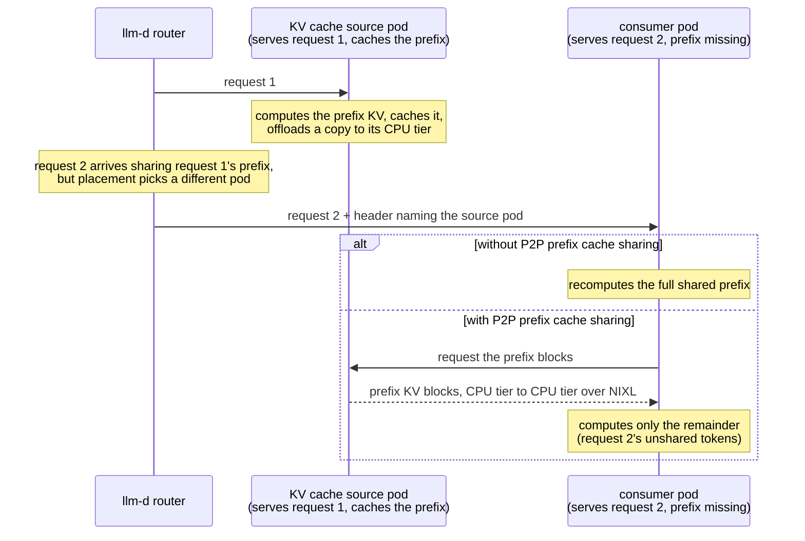

# P2P KV-Cache Sharing

P2P KV-cache sharing lets any vLLM instance pull cached prefix KV blocks directly from a peer's CPU offload tier instead of recomputing them. The transfer is CPU-to-CPU over NIXL (UCX, over RDMA when available). The source pod's GPU is never touched, so serving a pull costs the source no prefill capacity.

It composes the other KV-cache management capabilities into a fleet-wide cache:

- the vLLM `OffloadingConnector` with a P2P secondary tier ([KV-Cache Offloading](kv-offloader.md)): each pod is both a puller and a source;
- the precise, KV-event-fed prefix index ([KV-Cache Indexer](kv-indexer.md)), which tells the router which peer holds a request's prefix, on which tier;
- the llm-d Router's [precise prefix-cache aware routing](prefix-cache-aware-routing.md), extended with a `p2p-source-producer` that names the source on the request.

> [!NOTE]
> P2P KV-cache sharing is experimental. To deploy it, see the [P2P KV Cache Sharing well-lit path](../../../../guides/p2p-kv-cache-sharing/README.md).

## Why P2P Sharing

Prefix caches are per-pod, but their content is often fleet-wide: shared system prompts, common documents, session histories. Prefix-aware routing sends each request to the pod that caches its prefix, but routing cannot always follow the cache: a hot prefix's owner saturates, a working set outgrows any single pod, a session is rebalanced. Those requests recompute KV tensors that already exist on a peer.

The pull fires when a request shares a prefix with an earlier one but is scheduled to a different pod. Two requests share a prefix whenever they begin with the same tokens: the next turn of a conversation, another question against the same document, another session on a shared system prompt.

The first request's pod is the **KV cache source**: it computed the prefix and holds a copy in its CPU tier. When the router schedules a prefix-sharing request to a different pod, it names the source on the request, and the scheduled pod (the **consumer**) pulls the prefix instead of recomputing it:

## How It Works

1. **Model server pods publish KV-cache events** and run vLLM's `OffloadingConnector` (`TieringOffloadingSpec`) with a CPU tier plus a P2P secondary tier: every pod both offloads computed KV to CPU and serves it to peers. See [KV-Cache Offloading](kv-offloader.md) for the tiered connector.
2. **The router builds the precise prefix index** from the KV events, so it knows which pods hold which prefix blocks, on which tier. See [KV-Cache Indexer](kv-indexer.md).
3. **The `p2p-source-producer` selects a source** from the CPU-tier holders within one index block of the largest cached prefix, weighted to avoid concentrating pulls on a queued source. After scheduling, it sets the KV cache source header only when that source leads the computing pod by at least `minCachedTokenDelta` tokens.
4. **The routing sidecar injects `kv_transfer_params.remote_kv_source`** from the header, and the engine pulls the prefix blocks from the peer's CPU tier over NIXL.

Hits load as normal cache hits. A failed lookup is reported as a miss and the scheduled pod computes the missing prefix locally, so a request whose peer does not have the blocks degrades to baseline behavior rather than failing.

## When It Pays

Recompute cost grows with prefix length; the CPU-to-CPU pull grows much more slowly. The crossover is model-, hardware-, and transport-specific, so the router requests a pull only when the selected source holds at least `minCachedTokenDelta` more prefix tokens than the scheduled pod. The well-lit path shows how to [calibrate it](../../../../guides/p2p-kv-cache-sharing/README.md#4-optional-calibrate-mincachedtokendelta).

P2P sharing pays wherever routing cannot, or should not, send every request to the pod that already caches its prefix:

- **Load must spread.** A hot shared prefix saturates its cache owner under affinity routing. Load-aware routing plus the pull spreads the work while preserving cache reuse.
- **The working set exceeds any single pod's cache.** With N pods each caching 1/N of the prefix pool, cross-pod requests either recompute or pull.
- **Many concurrent sessions pinned to owner pods.** Sessions queue behind a busy owner or spill to a colder pod that recomputes, even when aggregate GPU capacity has room.
- **Long prefixes.** Pull time grows much more slowly with prefix length than recompute; route pulls only above the measured crossover.
- **Multi-turn sessions on P/D disaggregation.** Decode generates the session history, so on every turn the prefill worker faces KV it never computed and no routing decision can make local. The pull lets prefill fetch decode's generated KV directly (see [P/D Disaggregation](#pd-disaggregation)).

### Placement Trade-offs

What the pull is worth depends on the placement in front of it:

- **Affinity + P2P** sends each request to the pod that already holds its prefix, so the pull rarely fires: it is a fallback for the requests placement displaces, not a throughput feature, and it does not recover a restarted router (the prefix index loses the pre-restart cache map).
- **Load-aware + P2P** deliberately scatters requests, and the pull is what makes scattering affordable. It wins when many concurrent sessions contend on their owner pods; when nothing contends, affinity stays ahead because a local hit is free.
- **P/D + P2P** addresses KV that no placement decision could have made local.
- **When GPU KV capacity is the bottleneck**, cache co-location uses capacity more efficiently, because concurrent same-prefix requests on one pod share one copy of the blocks, while spreading pays a per-pod copy whether the prefix is pulled or recomputed.

Re-measure both placements on your own workload before assuming either generalizes.

## Requirements

P2P sharing builds on [tiered offloading](kv-offloader.md#cpu-tier): peers serve pulls from their CPU offload tier. Block hashes and KV layouts must agree across every peer that serves another:

- the same offloading block size (by default the engine's `--block-size`) on every peer;
- the same `PYTHONHASHSEED` fleet-wide, or no block hash ever matches across pods;
- KV-cache events published by every serving pod, so the index can find sources;
- a matching tensor-parallel layout between peers, because the peer session fingerprint embeds the parallel layout;
- a CPU tier larger than the per-pod GPU KV cache, so it retains the KV the GPU evicts rather than duplicating blocks that are still GPU-resident.

The well-lit path's [Best Practices](../../../../guides/p2p-kv-cache-sharing/README.md#best-practices) give the sizing rule and failure mode for each requirement.

## P/D Disaggregation

Under [P/D disaggregation](../disaggregation/README.md), the prefill worker is the pull consumer because it computes the prompt KV. A decode worker may be the source for generated session history retained in its CPU tier. After prefill completes, the normal NIXL P/D path transfers the request's KV to the selected decoder.

The engines run a `MultiConnector` (NIXL for the P/D transfer, the `OffloadingConnector` for the CPU tier and P2P listener), and the `p2p-source-producer` compares sources against the prefill profile's pod. See the [P/D variant](../../../../guides/p2p-kv-cache-sharing/README.md#pd-variant-p2p-over-nixl-disaggregation) for the configuration.

## Further Reading

- [P2P KV Cache Sharing well-lit path](../../../../guides/p2p-kv-cache-sharing/README.md) — deploy, calibrate, and verify P2P sharing.
- [KV-Cache Offloading](kv-offloader.md) — the CPU tier and tiered connector P2P serves from.
- [KV-Cache Indexer](kv-indexer.md) — the KV-event-fed index the source decision consumes.
- [Prefix-Cache Aware Routing](prefix-cache-aware-routing.md) — the precise routing P2P extends.
