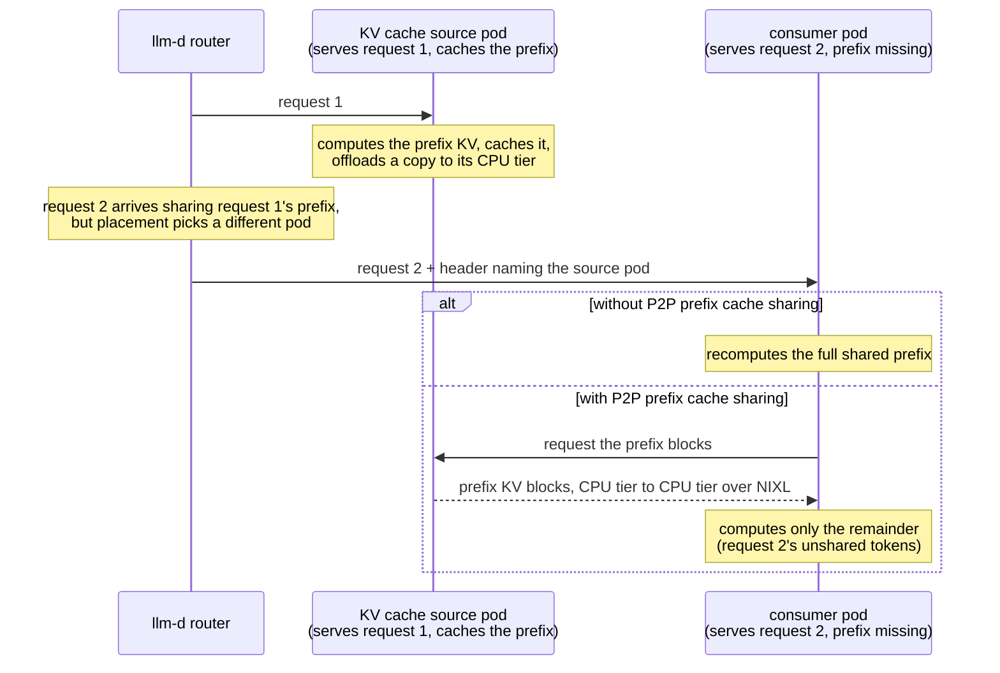

# [Experimental] P2P KV Cache Sharing

## Overview

This guide deploys peer-to-peer KV-cache sharing: any vLLM instance pulls cached prefix KV blocks directly from a peer's CPU offload tier instead of recomputing them. The transfer is CPU-to-CPU over NIXL (UCX, over RDMA when available). The source pod's GPU is never touched, so serving a pull costs the source no prefill capacity.

The deployment composes three llm-d capabilities:

- the vLLM `OffloadingConnector` with a P2P secondary tier: each pod is both a puller and a source;
- the llm-d Router's precise (KV-event-fed) prefix index from [Precise Prefix Cache Routing](../precise-prefix-cache-routing/README.md), which the source decision consumes;
- the `p2p-source-producer`, which selects a CPU-tier source from peers within one index block of the largest cached prefix while accounting for source queue depth. The routing sidecar injects `kv_transfer_params.remote_kv_source` and the engine pulls instead of recomputing.

The reference deployment is two aggregated `openai/gpt-oss-120b` replicas, one GPU each: the smallest fleet in which one pod can pull a prefix its peer computed. A P/D variant (pull on the prefill leg) is described in [P/D variant](#pd-variant-p2p-over-nixl-disaggregation).

### Why P2P sharing

Prefix caches are per-pod, but their content is often fleet-wide: shared system prompts, common documents, session histories. Prefix-aware routing sends each request to the pod that caches its prefix, but routing cannot always follow the cache: a hot prefix's owner saturates, a working set outgrows any single pod, a session is rebalanced. Those requests recompute KV tensors that already exist on a peer.

The pull fires when a request shares a prefix with an earlier one but is scheduled to a different pod. Two requests share a prefix whenever they begin with the same tokens: the next turn of a conversation, another question against the same document, another session on a shared system prompt. The first request's pod is the **KV cache source**: it computed the prefix and holds a copy in its CPU tier. When the router schedules a prefix-sharing request to a different pod, it names the source on the request, and the scheduled pod (the **consumer**) pulls the prefix instead of recomputing it:



> [!IMPORTANT]
> P2P sharing builds on the [Tiered Prefix Cache](../tiered-prefix-cache/README.md): peers serve pulls from their CPU offload tier. Every peer must use the same `--block-size`, `PYTHONHASHSEED`, and tensor-parallel layout, and the CPU tier must be sized to retain useful blocks. [Best Practices](#best-practices) covers each requirement, its sizing rule, and its failure mode.

### When to use this path

Recompute cost grows with prefix length; the CPU-to-CPU pull grows much more slowly. The crossover is model-, hardware-, and transport-specific, so the router requests a pull only when the selected source holds at least `minCachedTokenDelta` more prefix tokens than the scheduled pod (see [Calibrate `minCachedTokenDelta`](#4-optional-calibrate-mincachedtokendelta)).

P2P sharing pays wherever routing cannot, or should not, send every request to the pod that already caches its prefix:

- **Load must spread.** A hot shared prefix saturates its cache owner under affinity routing. Load-aware routing plus the pull spreads the work while preserving cache reuse.
- **The working set exceeds any single pod's cache.** With N pods each caching 1/N of the prefix pool, cross-pod requests either recompute or pull.
- **Many concurrent sessions pinned to owner pods.** Sessions queue behind a busy owner or spill to a colder pod that recomputes, even when aggregate GPU capacity has room.
- **Long prefixes.** Pull time grows much more slowly with prefix length than recompute; route pulls only above the measured crossover.
- **Multi-turn sessions on P/D disaggregation.** Decode generates the session history, so on every turn the prefill worker faces KV it never computed and no routing decision can make local. The pull lets prefill fetch decode's generated KV directly (see [P/D variant](#pd-variant-p2p-over-nixl-disaggregation)).

What the pull is worth depends on the placement in front of it:

- **Affinity + P2P** (the shipped default) sends each request to the pod that already holds its prefix, so the pull rarely fires: it is a fallback for the requests placement displaces, not a throughput feature, and it does not recover a restarted router (the prefix index loses the pre-restart cache map).
- **Load-aware + P2P** deliberately scatters requests, and the pull is what makes scattering affordable. It wins when many concurrent sessions contend on their owner pods; when nothing contends, affinity stays ahead because a local hit is free. To try it, drop the `prefix-cache-scorer` and `no-hit-lru-scorer` from the scheduling profile in the [router values](router/p2p-kv-cache-sharing.values.yaml) and replace the `max-score-picker` with the `weighted-random-picker`.
- **P/D + P2P** addresses KV that no placement decision could have made local.
- **GPU KV capacity is the bottleneck**: cache co-location uses capacity more efficiently, because concurrent same-prefix requests on one pod share one copy of the blocks, while spreading pays a per-pod copy whether the prefix is pulled or recomputed.

Re-measure both placements on your own workload before assuming either generalizes. Performance benchmarks are not part of this guide.

### Architecture

1. **Model server pods publish KV-cache events** and run vLLM's `OffloadingConnector` with a CPU tier plus a P2P secondary tier (port `7777`): every pod both offloads computed KV to CPU and serves it to peers.
2. **The router builds the precise prefix index** from the KV events, so it knows which pods hold which prefix blocks, on which tier.
3. **The `p2p-source-producer` selects a source** from the CPU-tier holders within one index block of the largest cached prefix, weighted to avoid concentrating pulls on a queued source. After scheduling, it sets the KV cache source header only when that source leads the computing pod by at least `minCachedTokenDelta` tokens.
4. **The routing sidecar injects `kv_transfer_params.remote_kv_source`** from the header, and the engine pulls the prefix blocks from the peer's CPU tier over NIXL. Hits load as normal cache hits; a failed lookup is reported as a miss and the scheduled pod computes the missing prefix locally, so a request whose peer does not have the blocks degrades to baseline behavior rather than failing.

## Supported Accelerators and Model Servers

This guide includes configurations for the following accelerator and model server combinations (set `ACCELERATOR_TYPE` and `MODEL_SERVER` accordingly). Each accelerator serves exactly one model:

<!-- guide:support start -->
| Accelerator | `ACCELERATOR_TYPE` | Served model | vLLM | Notes |
| --- | --- | --- | --- | --- |
| NVIDIA GPU | `gpu` | `openai/gpt-oss-120b` | 🟡 community | Default. H100/H200 80 GB+ · 2 replicas × TP=1 (2 GPUs) · 160 GiB memory per pod · `INFRA_PROVIDER`: `base` (TCP), `rdma` |
| Intel XPU | `xpu` | `Qwen/Qwen3-0.6B` | 🟡 community | 2 replicas × 1 GPU via DRA · TCP only (`INFRA_PROVIDER=base`) |

✅ validated: covered by a nightly E2E workflow · 🟡 community: maintained by the hardware vendor or community, not covered by nightly E2E · ❌ not supported: tracked in the linked issue · — no configuration.
<!-- guide:support end -->

SGLang has no equivalent of the `OffloadingConnector` P2P secondary tier, so this guide is vLLM-only.

> [!NOTE]
> The `token-producer` `modelName` in [`router/p2p-kv-cache-sharing.values.yaml`](router/p2p-kv-cache-sharing.values.yaml) is `openai/gpt-oss-120b`. On Intel XPU, set it to `Qwen/Qwen3-0.6B` (`MODEL`) before deploying the router: the render Service fronts the model servers, so a mismatched model is rejected and the router routes without token IDs.

**Transport (`INFRA_PROVIDER`).** NIXL/UCX moves the KV blocks over RDMA when the model server can reach an InfiniBand device, and falls back to TCP otherwise; the pull works either way. The transport sets the pull-versus-recompute crossover, and therefore `minCachedTokenDelta`:

- **`base`** (default) requests no RDMA device, so the pull runs over TCP. Calibrate `minCachedTokenDelta` for it rather than reusing the shipped value. This is the only overlay for Intel XPU: the P2P tier stages every transfer through its CPU-mmap-backed offload tier and registers only that host memory with NIXL/UCX, never XPU device memory, so the XPU overlay pins UCX to TCP. For transports that register XPU device memory with NIXL directly, see the open UCX `ze_copy` DMA-BUF-export issue ([openucx/ucx#11902](https://github.com/openucx/ucx/pull/11902), [#11903](https://github.com/openucx/ucx/pull/11903)).
- **`rdma`** (NVIDIA GPU) adds an `rdma/ib` device and `IPC_LOCK` to every model server. It is the recommended configuration for production GPU clusters that expose RDMA, and the one the shipped `minCachedTokenDelta: 2048` was measured on (gpt-oss-120b on H200, where the pull beat recompute at every measured prefix length from 2K to 48K tokens).

## Prerequisites

- Have the [proper client tools installed on your local system](../../helpers/client-setup/README.md) to use this guide.

- Ensure your cluster has enough accelerators for your configuration (default NVIDIA GPU configuration: 2 replicas with tensor parallelism 1, 2 GPUs in total, each with enough HBM for `openai/gpt-oss-120b`, e.g. H100 or H200). Each pod also requests 160 GiB of memory for its 88 GiB CPU tier; to change the replica count or the tier size, edit the [model server patch](./modelserver/gpu/vllm/base/patch-vllm.yaml).

- Create a [HuggingFace token](../../helpers/hf-token.md) and export it as `HF_TOKEN` in your shell. The router also reads it to reach gated tokenizers.

- The shipped images meet these requirements; check them if you swap images:
  - **Engine**: a vLLM image with the `OffloadingConnector` P2P secondary tier. Its robustness fixes ([vllm#48021](https://github.com/vllm-project/vllm/pull/48021), [vllm#49671](https://github.com/vllm-project/vllm/pull/49671), [vllm#49823](https://github.com/vllm-project/vllm/pull/49823), [vllm#49877](https://github.com/vllm-project/vllm/pull/49877)) and the wide-EP block-table alignment fix ([vllm#50302](https://github.com/vllm-project/vllm/pull/50302)) are all contained in vLLM `v0.27.0`, the first tagged release with the full set; the GPU overlay pins `v0.27.1`.
    The Intel XPU overlay uses `ghcr.io/llm-d/llm-d-xpu:v0.10.0` (vLLM 0.30.0); earlier `llm-d-xpu` images (v0.9.0 and before) lack `remote_kv_source` handling, and vLLM 0.30.0 needs `--enable-scale-out` (set by the overlay) to expose `/v1/*/render`.
  - **Routing sidecar**: an llm-d routing sidecar that injects `kv_transfer_params.remote_kv_source`. A sidecar emitting the older `p2p`/`prefill`/`decode` keys is silently inert against current engines (see [Troubleshooting](#troubleshooting)).
  - **Router (EPP)**: an image with the `p2p-source-producer` plugin; the router values pin `main` until a release ships it.

- (Optional) Install the [monitoring stack](../../docs/operations/observability/setup.md) if you plan to enable Prometheus monitoring.

### Get the guide

Every command below runs from a local clone of the [llm-d repository](https://github.com/llm-d/llm-d): the manifests, Helm values, and Kustomize overlays it applies live next to this guide. Set the branch and clone the repo (if you already have a checkout, skip this and run the remaining commands from inside it):

<!-- guide:prerequisites.clone start -->
<!-- llm-d-cicd:skip start -->
```bash
export BRANCH=main
git clone https://github.com/llm-d/llm-d.git && cd llm-d && git checkout ${BRANCH}
```
<!-- llm-d-cicd:skip end -->
<!-- guide:prerequisites.clone end -->

### Configure the environment

**Set the guide-specific environment variables:**

<!-- guide:env.static start -->
```bash
export REPO_ROOT=$(realpath $(git rev-parse --show-toplevel))
export GUIDE_NAME=p2p-kv-cache-sharing
export NAMESPACE=llm-d-p2p-kv-cache-sharing
export MONITORING=false # options: false, true
export MONITORING_VALUES=
export ACCELERATOR_TYPE=gpu # options: gpu, xpu
export MODEL_SERVER=vllm # options: vllm
export INFRA_PROVIDER=base # options: base, rdma
export MODEL=openai/gpt-oss-120b # set to the model your accelerator serves (table above)
source ${REPO_ROOT}/guides/env.sh # defines GAIE_VERSION, ROUTER_CHART_VERSION, router chart URLs, and CURL_TEST_IMAGE
```
<!-- guide:env.static end -->

**Install the Gateway API Inference Extension CRDs:**

<!-- guide:prerequisites.gaie start -->
```bash
# GAIE_URL is automatically calculated from GAIE_VERSION at ${REPO_ROOT}/guides/env.sh
kubectl apply -f https://github.com/kubernetes-sigs/gateway-api-inference-extension/${GAIE_URL}/v1-manifests.yaml
```
<!-- guide:prerequisites.gaie end -->

**Create a target namespace for the installation:**

<!-- guide:prerequisites.namespace start -->
```bash
kubectl create namespace ${NAMESPACE} --dry-run=client -o yaml | kubectl apply -f -
```
<!-- guide:prerequisites.namespace end -->

**Create the `llm-d-hf-token` secret** in your target namespace with the key [`HF_TOKEN`](../../helpers/hf-token.md) matching a valid HuggingFace token. `openai/gpt-oss-120b` is public, but the router reads the secret for gated tokenizers, so swapping in a gated model needs no other change:

<!-- guide:prerequisites.secrets start -->
<!-- llm-d-cicd:skip start -->
```bash
kubectl create secret generic llm-d-hf-token \
  --from-literal="HF_TOKEN=${HF_TOKEN}" \
  --namespace "${NAMESPACE}" \
  --dry-run=client -o yaml | kubectl apply -f -
```
<!-- llm-d-cicd:skip end -->
<!-- guide:prerequisites.secrets end -->

## Installation Instructions

### 1. Deploy the llm-d Router

**Prepare the paths to the `helm` values files** for the `llm-d` router (used in the deployment command below):

<!-- guide:deploy.router_values start -->
```bash
# Paths to values files
export ROUTER_BASE_VALUES="${REPO_ROOT}/guides/recipes/router/base.values.yaml"
export ROUTER_VALUES="${REPO_ROOT}/guides/${GUIDE_NAME}/router/${GUIDE_NAME}.values.yaml"
```
<!-- guide:deploy.router_values end -->

The [router values](router/p2p-kv-cache-sharing.values.yaml) deploy the affinity + P2P scheduling configuration: the precise prefix index, prefix-cache, queue, KV-utilization and no-hit-LRU scorers, and the `p2p-source-producer` with `minCachedTokenDelta: 2048`. On Intel XPU, set the `token-producer` `modelName` to `MODEL` first (see the note in [Supported Accelerators and Model Servers](#supported-accelerators-and-model-servers)).

**(Optional) Enable Prometheus monitoring on the `llm-d` router** by defining the `helm` values file (requires installing the monitoring stack mentioned in [Prerequisites](#prerequisites)):

<!-- guide:deploy.monitoring_values start -->
```bash
# only when MONITORING=true:
export MONITORING_VALUES="-f ${REPO_ROOT}/guides/recipes/router/features/monitoring.values.yaml"
```
<!-- guide:deploy.monitoring_values end -->

**Deploy the router** in [Standalone Mode](../../docs/architecture/core/router/proxy.md), with an Envoy sidecar in front of the router. The release name `${GUIDE_NAME}` is mandatory: the `InferencePool` selector matches a guide label that pairs with this release. To front the router with a Kubernetes Gateway instead, see Gateway Mode in the [Optimized Baseline](../optimized-baseline/README.md#1-deploy-the-llm-d-router).

<!-- guide:deploy.standalone start -->
```bash
helm install ${GUIDE_NAME} \
  ${ROUTER_STANDALONE_CHART} \
  -f ${ROUTER_BASE_VALUES} \
  ${MONITORING_VALUES} \
  -f ${ROUTER_VALUES} \
  -n ${NAMESPACE} --version ${ROUTER_CHART_VERSION}
```
<!-- guide:deploy.standalone end -->

### 2. Deploy the Model Server

For model sources, caching, and startup optimization, see the [Model Loading and Startup Acceleration operations guide](../../docs/operations/startup/model-loading-and-startup.md).

**With `INFRA_PROVIDER=rdma`, check the RDMA resource name** your nodes expose. The overlay requests `rdma/ib`; yours may differ (`rdma/hca`, `nvidia.com/rdma`, ...), in which case edit [`modelserver/gpu/vllm/rdma/patch-rdma.yaml`](modelserver/gpu/vllm/rdma/patch-rdma.yaml) to match:

<!-- guide:deploy.rdma_resource start -->
```bash
# only when INFRA_PROVIDER=rdma:
# The RDMA resource your nodes expose (the overlay requests rdma/ib)
kubectl get nodes -o jsonpath='{.items[0].status.allocatable}' | tr ',' '\n' | grep -i rdma
```
<!-- guide:deploy.rdma_resource end -->

**Apply the Kustomize overlay** for your accelerator and transport. Every overlay runs vLLM with `--block-size=64`, KV-cache events on the per-pod ZMQ socket (port `5556`), `PYTHONHASHSEED=0`, and the `OffloadingConnector` with a CPU tier and a P2P tier on port `7777`, behind the routing sidecar on port `8000` (the engine listens on `8200`):

<!-- guide:deploy.modelserver start -->
```bash
kubectl apply -n ${NAMESPACE} \
  -k ${REPO_ROOT}/guides/${GUIDE_NAME}/modelserver/${ACCELERATOR_TYPE}/${MODEL_SERVER}/${INFRA_PROVIDER}/
```
<!-- guide:deploy.modelserver end -->

**With `INFRA_PROVIDER=rdma`, confirm the device reached the container** once the pods are running. A pod that schedules without it serves normally and just pulls over TCP, so this failure looks like a performance result rather than a misconfiguration:

<!-- guide:deploy.rdma_device start -->
```bash
# only when INFRA_PROVIDER=rdma:
# The InfiniBand device must be visible inside the model server container
kubectl exec -n ${NAMESPACE} deploy/${GUIDE_NAME}-decode -c modelserver -- ls /dev/infiniband
```
<!-- guide:deploy.rdma_device end -->

### 3. Deploy the Render (Tokenizer) Service

The router's `token-producer` plugin tokenizes each prompt by calling vLLM's `/v1/completions/render` endpoint through a render Service, so it can look up the exact KV blocks the prompt maps to.

**Apply the render overlay:**

<!-- guide:deploy.render start -->
```bash
kubectl apply -n ${NAMESPACE} -k ${REPO_ROOT}/guides/${GUIDE_NAME}/render/
```
<!-- guide:deploy.render end -->

The `render/` overlay is a **Service with no pods of its own**: it selects the model server pods you just deployed and tokenizes on them, so render capacity scales with the fleet. Only `Ready` endpoints receive render calls, so apply it after the model servers. When serving CPU is contended, apply [`render/standalone/`](render/standalone/) instead: a dedicated, GPU-less render pool under the same Service name (see the render bullet in [Best Practices](#best-practices)).

**(Optional) Deploy the monitoring resources for model servers** (requires installing the monitoring stack mentioned in [Prerequisites](#prerequisites)):

<!-- guide:deploy.monitoring start -->
```bash
# only when MONITORING=true:
kubectl apply -n ${NAMESPACE} -k ${REPO_ROOT}/guides/recipes/modelserver/components/monitoring
```
<!-- guide:deploy.monitoring end -->

### 4. (Optional) Calibrate `minCachedTokenDelta`

The shipped router config sets `minCachedTokenDelta: 2048`, the crossover measured for the reference setup (gpt-oss-120b on H200 with `rdma/ib`). On any other model, accelerator, or transport, measure your own against the pods you just deployed:

<!-- guide:deploy.calibrate start -->
<!-- llm-d-cicd:skip start -->
```bash
NAMESPACE=${NAMESPACE} \
POD_SELECTOR=llm-d.ai/guide=${GUIDE_NAME} \
MODEL_NAME=${MODEL} \
${REPO_ROOT}/guides/recipes/router/calibration/calibrate-min-cached-token-delta.sh
```
<!-- llm-d-cicd:skip end -->
<!-- guide:deploy.calibrate end -->

The recipe prints the recommended value; set it on the `p2p-source-producer` in the router values, re-apply the router release, and restart the EPP. See [Calibrating `minCachedTokenDelta`](../recipes/router/calibration/README.md#calibrating-mincachedtokendelta) for what it measures and its prerequisites. Measure on a warmed pod pair: the first pull between two peers pays a one-time session-establishment cost, which the recipe excludes.

## Verification

### 1. Get the IP of the Proxy

<!-- guide:verify.endpoint.standalone start -->
```bash
export IP=$(kubectl get service ${GUIDE_NAME}-epp -n ${NAMESPACE} -o jsonpath='{.spec.clusterIP}')
```
<!-- guide:verify.endpoint.standalone end -->

### 2. Check the Render Service

**Check that the render Service returns token IDs for your model** (`MODEL` must be the model your accelerator serves). The response is a JSON list whose first entry carries `token_ids`. This fails on an empty selector, a wrong `targetPort`, or an unavailable render API:

<!-- guide:verify.tests.render start -->
```bash
# The render Service must return token IDs for MODEL before requests are routed
kubectl run render-check --rm -i --restart=Never \
  --image=${CURL_TEST_IMAGE} \
  --namespace="${NAMESPACE}" \
  --env="GUIDE_NAME=${GUIDE_NAME}" \
  --env="MODEL=${MODEL}" \
  -- /bin/sh -c 'curl -sS -X POST "http://${GUIDE_NAME}-render:8000/v1/completions/render" -H "Content-Type: application/json" -d "{\"model\": \"${MODEL}\", \"prompt\": \"render check\", \"max_tokens\": 1}"'
```
<!-- guide:verify.tests.render end -->

### 3. Send Test Requests

**Send a completion request from a temporary pod inside the cluster:**

<!-- guide:verify.tests.request start -->
```bash
kubectl run curl-test --rm -i --restart=Never \
  --image=${CURL_TEST_IMAGE} \
  --namespace="${NAMESPACE}" \
  --env="IP=${IP}" \
  --env="MODEL=${MODEL}" \
  -- /bin/sh -c 'curl -sS -X POST "http://${IP}/v1/completions" -H "Content-Type: application/json" -d "{\"model\": \"${MODEL}\", \"prompt\": \"How are you today?\"}"'
```
<!-- guide:verify.tests.request end -->

### 4. Verify the P2P pull

A served request only proves the stack is up. An inert P2P misconfiguration looks identical to "no effect": requests serve fine, and nothing is pulled. To confirm the mechanism is engaged, compute a fresh prefix on one model server, then ask its peer, which has never seen that prefix, to pull it.

**Seed a prefix on the source pod and pull it on the consumer pod.** Both requests go straight to the engines (port `8200`); the second one carries the same `kv_transfer_params.remote_kv_source` the routing sidecar injects when the router names a source:

<!-- guide:verify.tests.p2p_pull start -->
```bash
# Compute a new ~2k-token prefix on the first pod (the source), then send it
# to the second pod (the consumer), which has never seen it, naming the
# source in kv_transfer_params so the consumer pulls it instead of recomputing
PODS=($(kubectl get pods -n ${NAMESPACE} -l llm-d.ai/guide=${GUIDE_NAME} -o jsonpath='{.items[*].metadata.name}'))
IPS=($(kubectl get pods -n ${NAMESPACE} -l llm-d.ai/guide=${GUIDE_NAME} -o jsonpath='{.items[*].status.podIP}'))
kubectl run p2p-pull-test --rm -i --restart=Never \
  --image=${CURL_TEST_IMAGE} \
  --namespace="${NAMESPACE}" \
  --env="SOURCE=${IPS[0]}" \
  --env="CONSUMER=${IPS[1]}" \
  --env="MODEL=${MODEL}" \
  -- /bin/sh -c 'N=$(date +%s); P=$(for i in $(seq 1 100); do printf "Run ${N}: the consumer pulls this prefix from the CPU tier of the pod that computed it. "; done)
    curl -sS -o /dev/null -w "source ${SOURCE}: HTTP %{http_code}\n" -X POST "http://${SOURCE}:8200/v1/completions" \
      -H "Content-Type: application/json" \
      -d "{\"model\": \"${MODEL}\", \"prompt\": \"${P}\", \"max_tokens\": 1}"
    sleep 5
    curl -sS -o /dev/null -w "consumer ${CONSUMER}: HTTP %{http_code}\n" -X POST "http://${CONSUMER}:8200/v1/completions" \
      -H "Content-Type: application/json" \
      -d "{\"model\": \"${MODEL}\", \"prompt\": \"${P}\", \"max_tokens\": 1, \"kv_transfer_params\": {\"remote_kv_source\": {\"kv_request_id\": \"p2p-check-${N}\", \"remote_host\": \"${SOURCE}\", \"remote_port\": 7777}}}"'
```
<!-- guide:verify.tests.p2p_pull end -->

**Read the consumer's external prefix-cache counters:**

<!-- guide:verify.tests.pull_metrics start -->
```bash
# External prefix-cache counters of the consumer pod, read through the
# Kubernetes API server proxy (no port-forward needed)
kubectl get --raw "/api/v1/namespaces/${NAMESPACE}/pods/${PODS[1]}:8200/proxy/metrics" \
  | grep -E '^vllm:external_prefix_cache_(hits|queries)_total' || true
```
<!-- guide:verify.tests.pull_metrics end -->

What to expect: both requests return HTTP 200, and `vllm:external_prefix_cache_hits_total` on the consumer is well above zero (roughly the prefix length in tokens, rounded down to whole 64-token blocks). The consumer has no local copy of the fresh prefix, so these hits can only come from the peer's CPU tier; the count also proves that block hashes agree across pods.

If the hits stay at zero, check that `PYTHONHASHSEED` and `--block-size` match on both pods, and look in the source's log for `rejecting peer` (`kubectl logs -n ${NAMESPACE} ${PODS[0]} -c modelserver`).
Once the direct pull works, router-driven pulls show up as `running P2P source protocol` lines with a `source_host` in the routing sidecar's log (`kubectl logs -n ${NAMESPACE} ${PODS[1]} -c routing-proxy`) on requests whose prefix a peer holds, and the EPP logs show KV-event subscriptions for every pod and non-zero prefix scores. Under the shipped affinity placement those pulls are rare by design (see [When to use this path](#when-to-use-this-path)).

## Best Practices

- **Keep the offloading block size identical across all P2P peers.** This guide omits `kv_connector_extra_config.block_size`, so it defaults to the engine's `--block-size`; therefore `--block-size` must be identical across all model server pods. If an explicit offloading `block_size` is configured instead, use the same value on every peer and make it a multiple of each peer's engine block size. The router's `tokenProcessorConfig.blockSize` is an independent indexing granularity and may differ.
- **Pin `PYTHONHASHSEED` to the same value fleet-wide.** vLLM seeds block hashes per process; unpinned seeds mean no block hash ever matches across pods and every lookup misses.
- **Set `--kv-events-config` on every serving pod**, topic `kv@<POD_IP>:<PORT>@<model>`. No events, no precise index, no source selection. `<PORT>` must be the port the router identifies the endpoint by: the routing sidecar's port (`8000` in this guide), not the engine port (`8200`). A mismatched port leaves the index empty, so no pull ever fires.
- **Match TP between peers that serve each other.** The peer session fingerprint embeds the parallel layout, so a TP-mismatched pair rejects the session and requests silently recompute. Hetero-TP works only for non-hybrid-attention models on the V1 model runner (`VLLM_USE_V2_MODEL_RUNNER=0` where V2 is the default); in-review upstream work stores offloaded KV in a parallelism-free layout ([vllm#48414](https://github.com/vllm-project/vllm/pull/48414)), removing the coupling.
- **Size `podCacheSize` for the fleet.** The router's per-block LRU of `(endpoint, tier)` holders must hold every legitimate holder of a hot block: size it at discovered endpoints × tiers. The shipped `32` covers up to 16 pods with a GPU and a CPU tier each; below that, real holders are evicted, affinity scores collapse, and the `p2p-source-producer` stops finding a peer to pull from.
- **Multi-pod data-parallel groups (LWS wide-EP) must compensate the socket base ports per pod.** vLLM binds the P2P and KV-events listeners at `configured base + global data_parallel_index`; the router addresses `pod IP + pod-local rank`. Those agree when each pod is its own DP group (every topology in this guide), but not for worker pods of a multi-pod group, and a mis-addressed pull does not fall back to recompute: it stalls the request until the client times out. Each pod subtracts its global start rank from both bases:

  ```bash
  START_RANK=$(( ${LWS_WORKER_INDEX:-0} * DP_SIZE_LOCAL ))
  P2P_BASE=$((7777 - START_RANK))        # P2P secondary tier port
  KV_EVENTS_BASE=$((5557 - START_RANK))  # KV-events publisher endpoint
  ```

  The router must also attribute KV events to the publishing rank's endpoint ([llm-d-router#2233](https://github.com/llm-d/llm-d-router/pull/2233)) and the sidecar must compare full endpoints in its self-pull guard ([llm-d-router#2234](https://github.com/llm-d/llm-d-router/pull/2234)); run a router build that carries both before enabling the pull on such a topology.
- **Set `offload_prompt_only` to match what peers can use.** Prefix pulls work under either setting; `false` additionally offloads *generated* KV so a conversation's full history is pullable. Pair `false` with the precise index and a chat template that re-renders answers verbatim. This guide runs `false`; use `true` for models that drop reasoning on re-render, whose generated KV is unreusable regardless.
- **Make the CPU tier (`cpu_bytes_to_use`) larger than the per-pod GPU KV cache**, 2x as the working default. The tier's value is the KV that the GPU evicts and the CPU *retains* (the [tiered path's](../tiered-prefix-cache/README.md) receptive field): a smaller tier mostly duplicates blocks that are still GPU-resident, and the router's view of who holds a prefix outruns what sources can actually serve.
  - Compute the ratio from measured KV capacity, not per-GPU intuition. Weights are paid once per pod while KV memory scales with TP, so per-pod KV capacity grows superlinearly with the TP degree. gpt-oss-120b on H200 at `--gpu-memory-utilization=0.85`: TP=1 leaves ~55 GB of KV (~1.4M tokens); TP=4 leaves ~414 GB (~10M tokens), so a 128 GiB tier is 2.3x the GPU cache at TP=1 and 0.33x at TP=4. Read the KV capacity from the engine startup log and size the tier from it, per role.
  - Size `/dev/shm` above `cpu_bytes_to_use` (the tier is an shm mmap) and the pod memory limit above both: the memory-backed emptyDir counts against the pod's limit.
  - With data parallelism (`--data-parallel-size` N > 1), each DP replica gets its own tier region and P2P port: `/dev/shm` must exceed N × `cpu_bytes_to_use`, and rank `r` listens on the configured port + `r`. This requires vLLM with per-DP-rank P2P ports and per-replica offload regions ([vllm#47636](https://github.com/vllm-project/vllm/pull/47636), [vllm#47987](https://github.com/vllm-project/vllm/pull/47987)).
- **Size render capacity to the request rate.** The default `render/` Service fronts the model servers themselves ([llm-d#2188](https://github.com/llm-d/llm-d/pull/2188)) and targets the vLLM port directly; the pods' port `8000` belongs to the routing sidecar, which does not serve `/render`.
  When serving CPU is contended, apply `render/standalone/` instead and scale it (`kubectl scale -n ${NAMESPACE} deploy/${GUIDE_NAME}-render --replicas=<N>`): one replica saturates near 10 req/s at ~50K-token prompts, and past saturation every request stalls for the `token-producer` `vllm.timeout` (default 5 s), then routes without token IDs, silently disabling prefix scoring while engines sit idle. Alert on flat TTFT plateaus at the timeout value.
  The standalone pool serves `openai/gpt-oss-120b`; for another model, change the model argument in [`render/standalone/deployment.yaml`](render/standalone/deployment.yaml) together with the router `token-producer` `modelName`.

## P/D variant: P2P over NIXL disaggregation

Under P/D disaggregation, the prefill worker is the pull consumer because it computes the prompt KV. A decode worker may be the source for generated session history retained in its CPU tier. After prefill completes, the normal NIXL P/D path transfers the request's KV to the selected decoder.

Start from the [P/D disaggregation guide](../pd-disaggregation/README.md) topology and change three things:

1. **Engines run `MultiConnector`**: NIXL carries the P/D transfer, and the `OffloadingConnector` provides the CPU tier and the P2P listener. Use the same config on both legs (a pod serves pulls regardless of role):

   ```json
   {"kv_connector":"MultiConnector","kv_role":"kv_both",
    "kv_connector_extra_config":{"connectors":[
      {"kv_connector":"NixlConnector","kv_role":"kv_both"},
      {"kv_connector":"OffloadingConnector","kv_role":"kv_both",
       "kv_connector_extra_config":{"spec_name":"TieringOffloadingSpec",
        "cpu_bytes_to_use":94489280512,"offload_prompt_only":false,
        "secondary_tiers":[{"type":"p2p","host":"$(POD_IP)","port":7777}]}}]}}
   ```

   Both side channels must bind the pod IP via the downward API: `VLLM_NIXL_SIDE_CHANNEL_HOST` and `VLLM_P2P_SIDE_CHANNEL_HOST`. All of the [Best Practices](#best-practices) apply unchanged. Size `cpu_bytes_to_use` **per role**: decode legs typically run higher TP, so their per-pod GPU KV (and the tier that must exceed it) is several times a prefill pod's; the value above is a prefill-leg (TP=1) size. Decode must run `offload_prompt_only: false`, with a chat template that re-renders generated answers verbatim.

2. **The routing sidecar declares the tier** with `--kv-connector=nixlv2 --enable-p2p-pull` (plus `--p2p-connector-port=7777` if not the default). `--enable-p2p-pull` is accepted only with `--kv-connector=nixlv2`; with `--kv-connector=offloading` the tier is native and the flag is unnecessary.

3. **The EPP scheduling config targets the prefill profile**: set the `p2p-source-producer`'s `prefillProfileName` to the disaggregation prefill profile name (default `prefill`), so the source comparison runs against the pod that will actually compute the prefix.

Size the decode pool for its NIXL intake: each request ships its full KV from prefill to decode, and that intake, not prefill placement, is typically the topology's ceiling.

## Troubleshooting

| Symptom | Cause | Fix |
| --- | --- | --- |
| No pulls, everything serves; EPP logs `bestCachedTokens:0` for every request | index empty: block-size mismatch, missing kv-events, kv-events topic port not matching the router's endpoint port, or hash disagreement (`PYTHONHASHSEED`) | re-run the render check and the [P2P pull check](#4-verify-the-p2p-pull) |
| `rejecting peer connect: block_len mismatch` | `--block-size` differs between pods | align it everywhere |
| No pulls from a TP-mismatched source, index and hashes fine | peer session fingerprint is TP-locked | matched TP; hetero-TP only for non-hybrid models on the V1 runner ([Best Practices](#best-practices)) |
| Pulls fire but hit rate ~0 | CPU tier too small vs GPU cache; prefixes evicted before peers ask | grow `cpu_bytes_to_use` (and `/dev/shm`) |
| Sidecar exits with `unknown flag: --enable-p2p-pull` | sidecar image predates the NIXL P/D pull path | use a sidecar build that includes it |
| Zero router-driven pulls, the direct P2P pull check passes | sidecar emits the old sub-dict keys (`p2p`/`prefill`/`decode`); the engine ignores them | use a sidecar built with the renamed keys (`remote_kv_source`/`remote_prefiller`/`remote_decoder`) |
| TTFT pins flat at ~the `token-producer` timeout (default 5 s) at every rate above some cliff; engines report near-zero queue/prefill time | render capacity saturated; every EPP render call times out and requests proceed late without token IDs | apply `render/standalone/` and scale it per [Best Practices](#best-practices); verify with a direct load test against `/v1/completions/render` |

## Cleanup

To remove the deployed components:

<!-- guide:cleanup.modelserver start -->
```bash
kubectl delete -n ${NAMESPACE} -k ${REPO_ROOT}/guides/${GUIDE_NAME}/modelserver/${ACCELERATOR_TYPE}/${MODEL_SERVER}/${INFRA_PROVIDER}
```
<!-- guide:cleanup.modelserver end -->

<!-- guide:cleanup.render start -->
```bash
kubectl delete -n ${NAMESPACE} -k ${REPO_ROOT}/guides/${GUIDE_NAME}/render/
```
<!-- guide:cleanup.render end -->

<!-- guide:cleanup.rest start -->
```bash
helm uninstall ${GUIDE_NAME} -n ${NAMESPACE}

kubectl delete -n ${NAMESPACE} -k ${REPO_ROOT}/guides/recipes/modelserver/components/monitoring --ignore-not-found=true
```
<!-- llm-d-cicd:skip start -->
```bash
kubectl delete namespace ${NAMESPACE}
```
<!-- llm-d-cicd:skip end -->
<!-- guide:cleanup.rest end -->
